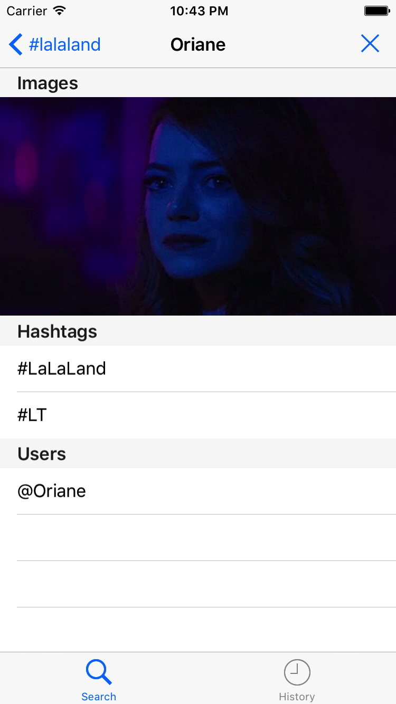

# Smashtag
Project from iTunes "Developing iOS 9 Apps with Swift" (assignment 4) with the solutions from blog: https://cs193p.m2m.at

The app was a client of Twitter that give ready-access to hashtags, urls, images and users mentioned in a tweet.

  
  
  
  

